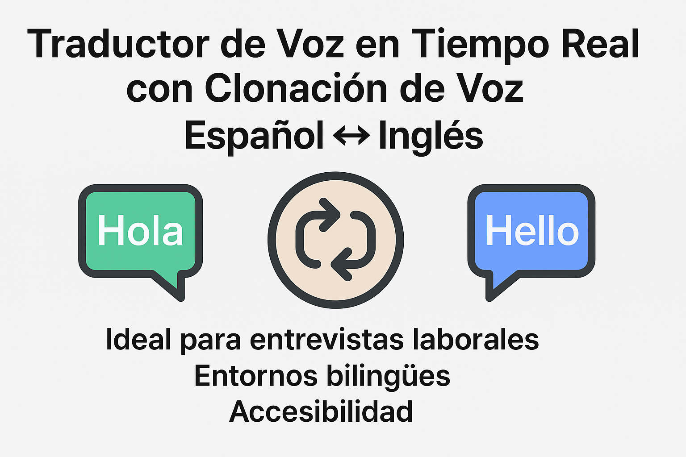

# 🧠 Traductor de Voz en Tiempo Real con IA


Traductor bidireccional de voz en tiempo real: hablá en español o inglés, escuchá la traducción en el otro idioma con voz realista clonada.

## 🎯 Características principales

- Traducción en tiempo real (Español ↔ Inglés)
- Transcripción y traducción visible en pantalla
- Audio traducido con voz natural (usando ElevenLabs)
- Botón de activación (modo escucha)
- Interfaz minimalista tipo "modo invisible"
- Compatible con auriculares Bluetooth
- Funcionamiento en segundo plano
- Ejecutable en PC o desde navegador web

---

## 🧰 Tecnologías utilizadas

| Herramienta        | Propósito                                      |
|--------------------|-----------------------------------------------|
| Python 3.9+        | Lenguaje principal                             |
| Gradio 4+          | Crear interfaz web simple                      |
| faster-whisper     | Transcripción de voz a texto (CTranslate2, 4-5x más rápido en CPU) |
| Deep Translator    | Traducción de texto (GoogleTranslator)         |
| ElevenLabs SDK 1+  | Generación de voz realista                     |
| python-dotenv      | Carga de variables de entorno desde `.env`     |

---

## 🧪 Demo visual de la app

```plaintext
+-------------------------------+
| [🎙️ ESCUCHAR]                |
|-------------------------------|
| 📝 Transcripción:                |
| "Lo que dijiste en español"    |
|-------------------------------|
| 🌐 Traducción:                   |
| "What you said in English"   |
|-------------------------------|
| 🔊 Audio con voz realista       |
|  [ Reproducir ▶ ]              |
+-------------------------------+
```

---

## 📦 Instalación y ejecución local

### 1. Clonar el repositorio
```bash
git clone https://github.com/victalejo/-Traductor-de-Voz-en-Tiempo-Real-con-Voz-Clonada-Espanol-Ingles.git
cd -Traductor-de-Voz-en-Tiempo-Real-con-Voz-Clonada-Espanol-Ingles
```

### 2. Instalar dependencias
Asegurate de tener `Python 3.9+` instalado. Luego ejecutá:
```bash
pip install -r requirements.txt
```

### 3. Configurar tu API Key de ElevenLabs
Copiá el archivo de ejemplo y completá tu clave personal ([pedila desde https://www.elevenlabs.io](https://www.elevenlabs.io)):
```bash
cp env.example .env
# editá .env y pegá tu ELEVENLABS_API_KEY
```

Variables opcionales soportadas en `.env`:
- `ELEVENLABS_VOICE_ID` — ID de la voz a usar (default: Rachel)
- `WHISPER_MODEL` — `tiny`, `base`, `small`, `medium`, `large-v2` o `large-v3` (default: `base`)
- `WHISPER_DEVICE` — `auto`, `cpu` o `cuda` (default: `auto`)
- `WHISPER_COMPUTE_TYPE` — `int8`, `float16`, `float32` (default: `int8`; usá `float16` en GPU)

### 4. Ejecutar la aplicación

```bash
python app.py
```
Se abrirá tu navegador con la app lista para usar. En el selector de idioma, elegí `auto` para que Whisper detecte español o inglés automáticamente.

---

## 📱 Versión web/móvil
- Si accedés desde tu celular, podés usar el navegador
- Compatible con modo escritorio o touch
- Proximamente: empaquetado como APK para Android o como PWA (instalable desde navegador)

---

## 🎧 Recomendaciones de uso
- Usá auriculares Bluetooth con micrófono para una mejor experiencia
- El sistema funciona en segundo plano si mantenés la pestaña activa
- Ideal para entrevistas, reuniones, y entornos laborales en inglés

---

## 🤖 Contribuciones futuras
- Streaming de audio en chunks para latencia menor (verdadero tiempo real)
- Integración con WebRTC para llamadas en vivo
- Modo "entrevista" (detectar dos voces por separado)
- Historial de conversaciones traducidas
- Tests automáticos y CI

---

## 📩 Contacto
Hecho por María Inés Hiriart 

Si querés aportar, sugerir mejoras o integrar esta solución a tu trabajo, abrí un issue o escribime a mihiriart74@gmail.com

---

## ⚠️ Licencia
Distribuido bajo licencia MIT. Ver [LICENSE](LICENSE) para el texto completo.
Asegurate igualmente de cumplir con los términos de uso de ElevenLabs y otros servicios externos.

